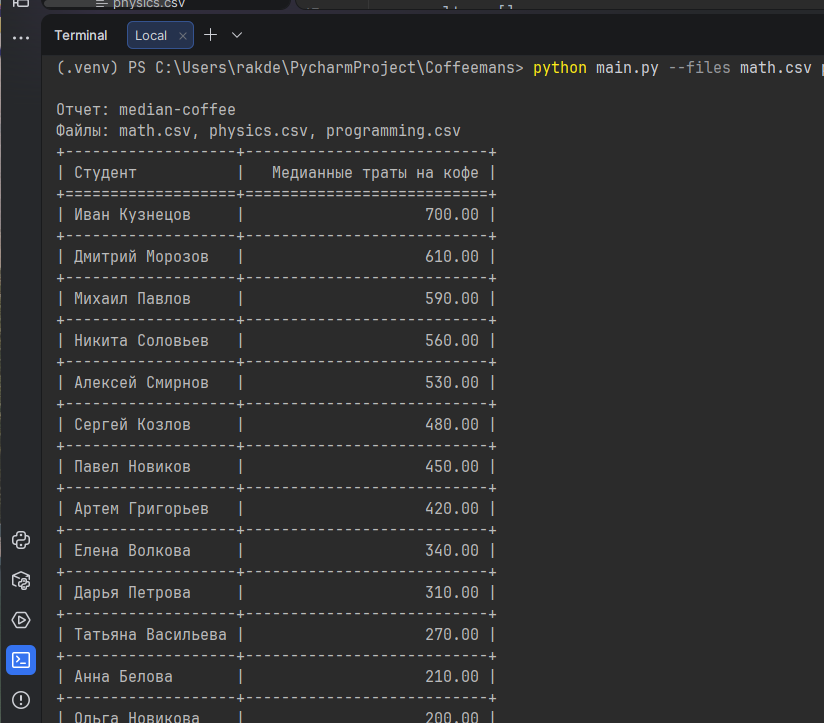

Скрипт читает файлы с данными о подготовке студентов к экзаменам и формирует отчеты. Нужно сформировать один отчет в котором будет медианная сумма трат на кофе по каждому студенту за весь период сессии. Отчёт включает в себя список студентов и медиану трат (по колонке coffee spent), отчёт сортируются по убыванию трат. Название файлов (может быть несколько) и название отчета передается в виде параметров --files и --report (в нашем случае это median-coffee). Отчёт формируется по всем переданных файлам, а не по каждому отдельно.
Чтобы сфокусироваться на функционале формирования отчёта и не отвлекаться на рутинные задачи (обработку параметров скрипта, чтения файлов и вывод), можно использовать стандартную библиотеку argparse и csv, для расчета медианы statistics, а для отображения в консоли tabulate.

Какие функциональные требования?

можно передать пути к файлам через --files
можно указать название отчета через --report (median-coffee)
в консоль (не в файл) выводится отчёт в виде таблицы

Какие не функциональные требования?

для всего кроме тестов и вывода в консоль, можно использовать только стандартную библиотеку, например:
для обработки параметров скрипта нельзя использовать click, можно argparse
для чтения файлов нельзя использовать pandas, но можно csv
в архитектуру заложена возможность добавления новых отчётов, как раз через параметр --report, в дальнейшем нужно будет добавлять отчёты с другой логикой расчетов, поэтому их добавление должно быть удобным.
код покрыт тестами написанными на pytest
для тестов можно использовать любые дополнительные библиотеки
код соответствует:
общепринятым стандартам написания проектов на python
общепринятому стилю

Запуск в терминале: Согласно ТЗ - отчет по медианной сумме

`python main.py --files math.csv physics.csv programming.csv --report median-coffee`

или

Добавил от себя: отчет по средней сумме

`python main.py --files math.csv physics.csv programming.csv --report mean-coffee `

Запуск тестов: `pytest tests.py -v -s`

Покрытия: `pytest tests.py --cov=main --cov-report=term-missing`

